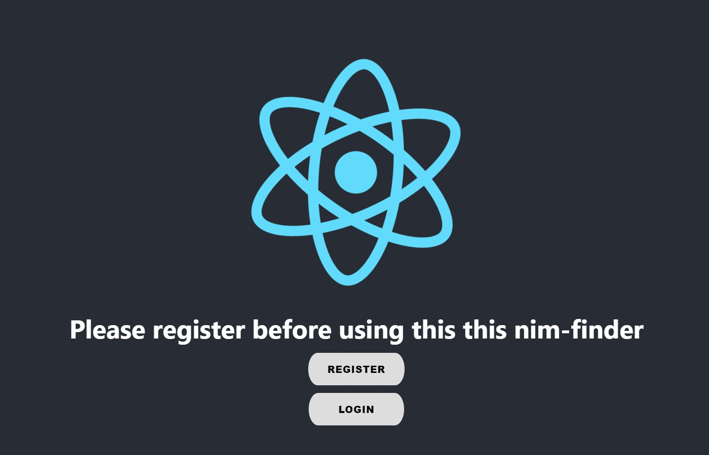
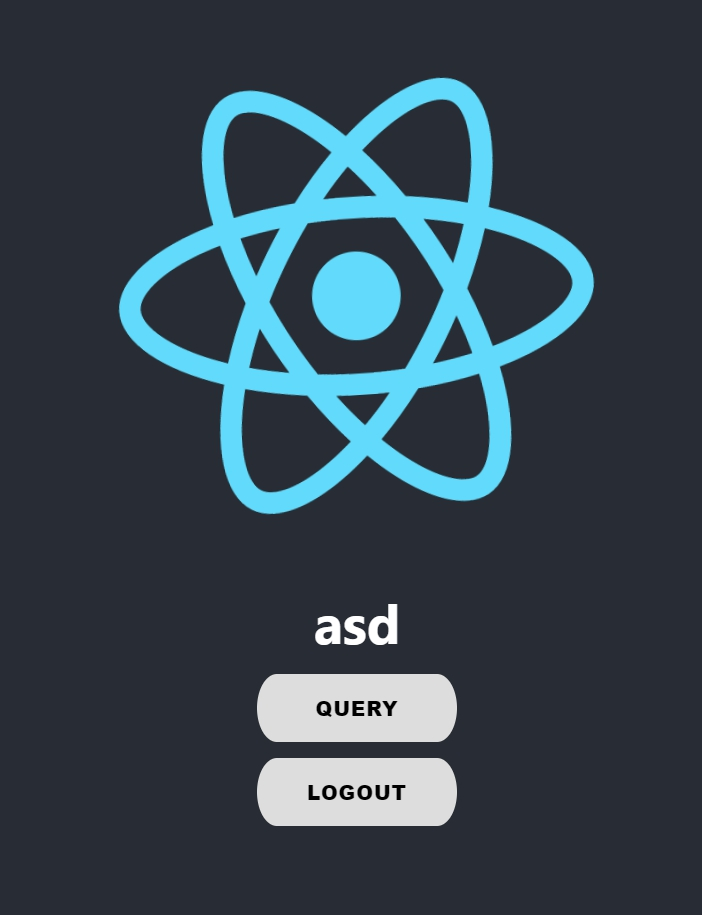
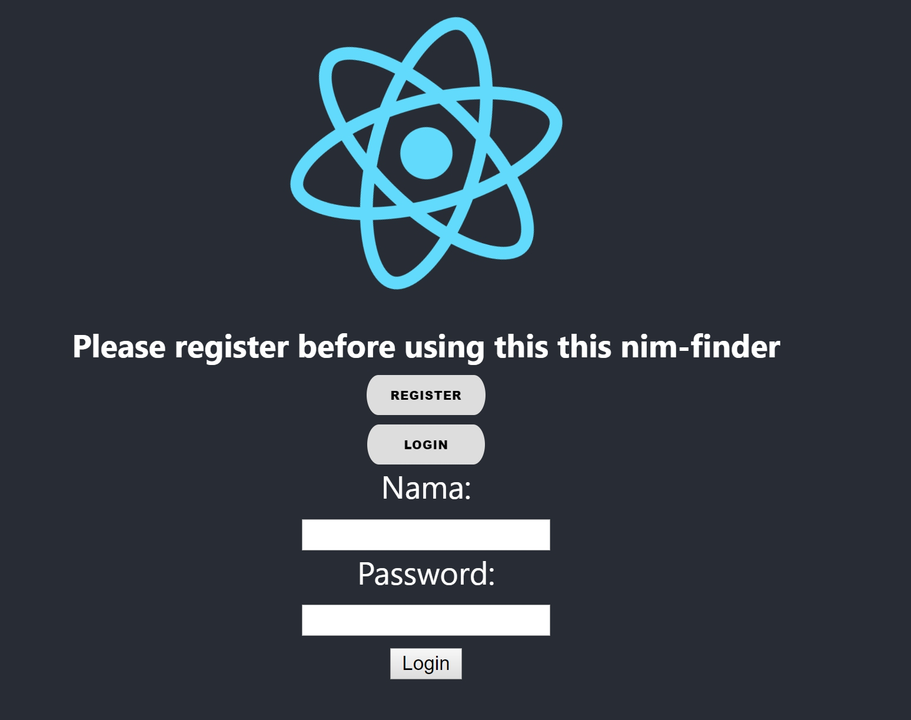
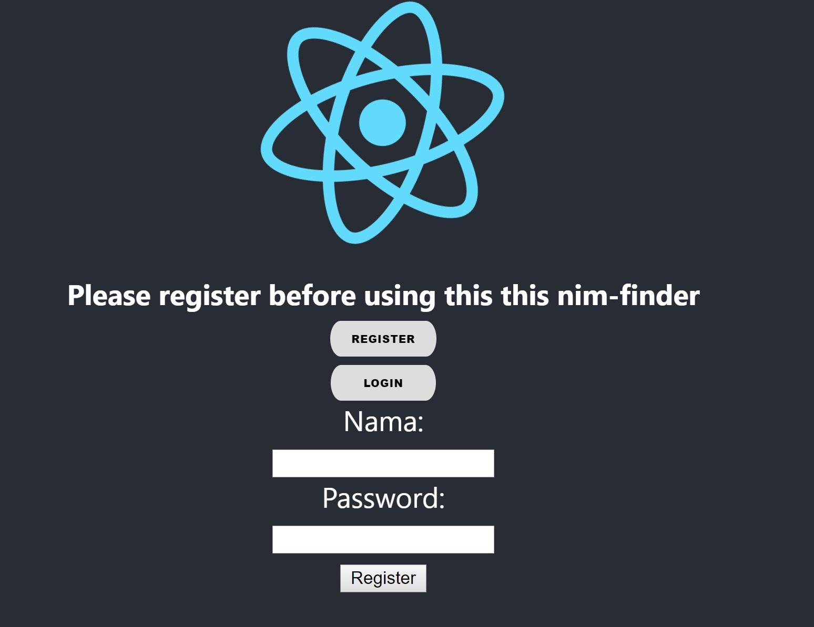
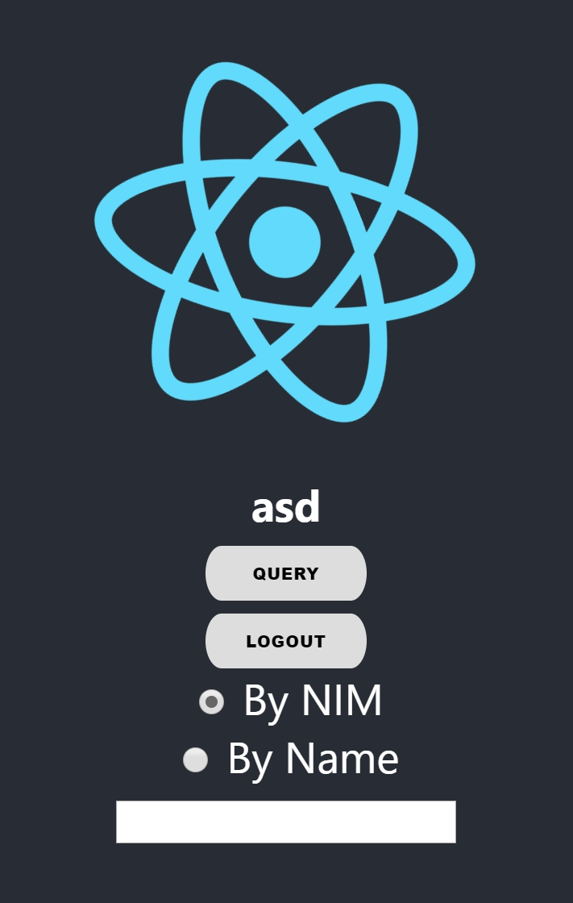

# NIM Finder
By: Adyaksa Wisanggeni 13517091    
## Setup
Untuk menjalankan alplikasi ini, anda diharuskan memiliki npm (6.9.0)
Untuk menjalankannya cukup jalankan ```npm run``` pada terminal di directory folder utama dari repository
Demo aplikasi juga dapat dijalankan di https://firastic.github.io/nim-finder/
-   Cara menggunakan aplikasi (termasuk screenshot dari aplikasi Anda)
    
-   Desain aplikasi (class yang dibuat/digunakan, bagaimana aplikasi bekerja, dsb.)
Terdapat 6 buah komponen pada program ini
1. Navigation: Memilih komponen apa yang akan ditampilkan


2. Login: Melakukan login

3. Register: Melakukan registrasi

4. Autentikasi: Cara melakukan autentikasi
5. Query: Melakukan query

6. Table: Membuat table dari hasil query


Alur kerja program ini adalah sebagai berikut
1. Navigation memilih komponen apa yang akan ditampilkan
2. Jika pengguna memilih login, login akan memanggil autentikasi dan memberikan cara menghandle login tersebut yang akan digunakan oleh autentikasi, hal yang sama berlaku untuk registrasi
3. Jika pengguna memilih query, maka pengguna dapat memilih akan melakukan pencarian berdasarkan nim atau nama. Setelah memasukkan input, query akan memanggil table untuk menampilkan hasil query  

## Library/kakas yang digunakan dalam aplikasi Anda
1.  button.css diambil dari [https://freefrontend.com/css-buttons/](https://freefrontend.com/css-buttons/) dengan sedikit perubahan
2. Library native-cookies
3. ReactJS

## Review API
Penggunaan api byid dan byname merupakan hal yang redundan. Dikarenakan nim mahasiswa terdiri dari angka dan nama mahasiswa terdiri dari huruf, API seharusnya dapat menerima segala jenis input dan melakukan parsing secara internal, sehingga ia hanya memerlukan 1 buah endpoint